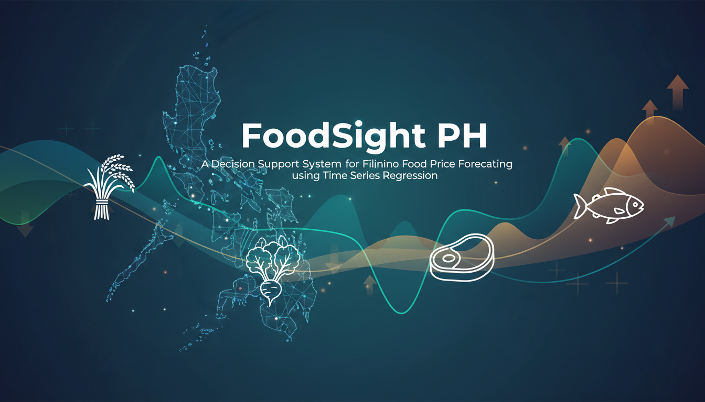

<div align="center">

# FoodSight PH  
### **Filipino Food Price Forecasting Dashboard**  
**Predictive Modeling using Time Series Regression (SARIMAX)**  
*A Decision Support System for Food Price Volatility Mitigation*

---



---

[]()
[]()
[]()
[]()

</div>

---

## Overview
**FoodSight PH** is a machine learning–powered decision support system designed to **forecast the monthly retail prices** of 20 essential agricultural commodities in the Philippines.

To address food price volatility, the system implements a **Hybrid Time Series Strategy** that dynamically selects between:

- **SARIMAX** (Seasonal AutoRegressive Integrated Moving Average with Exogenous Variables)
- **Pure SARIMA** models

It integrates historical market data from the WFP with key economic indicators to provide accurate price forecasts **up to 2027**, empowering policymakers, consumers, and researchers.

---

## Key Objectives
- **Forecast:** Predict future prices for essential food commodities  
- **Analyze:** Visualize seasonal trends and price cycles  
- **Support:** Provide data-driven insights for market stability and policy-making  

---

## Modeling Workflow (High-Level Overview)

```
            +---------------------------+
            |  Historical Price Data    |
            |    (2000–2025)            |
            +-------------+-------------+
                          |
                          v
           +-------------------------------+
           |  Feature Integration           |
           |  • GWPI                        |
           |  • Inflation Rate (YoY)        |
           |  • Global Fuel Prices          |
           +-------------------------------+
                          |
                          v
     +------------------------------------------------+
     |  Hybrid Time Series Selection Mechanism        |
     |  • SARIMAX (with exogenous variables)          |
     |  • SARIMA (if SARIMAX underperforms)           |
     +------------------------------------------------+
                          |
                          v
               +-----------------------+
               |   Model Training      |
               |  (Auto-tuning via     |
               |   Auto-ARIMA, AIC,    |
               |   MAE/RMSE/MAPE)      |
               +-----------+-----------+
                           |
                           v
              +-------------------------+
              |  Forecast Generation     |
              |     (2025–2027)          |
              +-------------+-----------+
                            |
                            v
               +--------------------------+
               |   Streamlit Dashboard     |
               | Interactive Visualization |
               +--------------------------+
```

---

## 🥗 Commodities Tracked (20 Items)

### **Cereals**
- Rice (Regular, Milled)  
- Maize (White, Yellow)

### **Meats**
- Chicken  
- Pork  
- Beef  

### **Vegetables**
- Red Onions, Garlic  
- Cabbage, Tomatoes, Potatoes  

### **Fruits**
- Bananas (Lakatan, Saba)  
- Mangoes  

### **Others**
- Eggs  
- Sugar  
- Coconut  
- Fish (Bangus, Tilapia)

---

## Architecture & Methodology
The model uses historical data from **2000–2025**, enhanced by the following **exogenous variables**:

- **GWPI – General Wholesale Price Index**
- **Inflation Rate – Year-on-Year Basis**
- **Global Fuel Prices – Brent Crude Oil, Diesel**

The **SARIMAX model** is the primary predictor, and falls back to SARIMA when exogenous regression does not improve performance.

---

## Project Structure

```
FoodSight PH/
│
├── models/                     # Pre-trained SARIMAX models (.joblib)
│   ├── Bananas_(lakatan)_SARIMAX_model.joblib
│   ├── Rice(regular,_milled)_SARIMAX_model.joblib
│   └── ...                     (20 total models)
│
├── app.py                      # Main Streamlit dashboard application
├── dashboard_data.json         # Cached forecast data (faster loading)
│
├── sarimax_final_training_data_complete_updated.csv  # Full training dataset
├── wfp_food_prices_phl (main).csv                   # Raw WFP dataset
│
├── requirements.txt            # Python dependencies
├── banner.png                  # Project banner image
├── preview.png                 # Dashboard preview image (optional)
└── README.md                   # Project documentation
```

---

## Installation & Usage

### **Prerequisites**
- Python **3.8+**
- Git installed

---

### **1. Clone the Repository**
```bash
git clone https://github.com/yourusername/foodsight-ph.git
cd foodsight-ph
```

### **2. Install Dependencies**
Using a virtual environment is recommended.

```bash
pip install -r requirements.txt
```

### **3. Run the Streamlit Dashboard**
```bash
streamlit run app.py
```

### **4. Access the App**
The application opens automatically.  
Or visit manually:

🔗 **http://localhost:8501**

---

## Technologies Used

### Frontend
- **Streamlit**

### Data Processing
- **Pandas**
- **NumPy**

### Visualization
- **Plotly** (Interactive Charts)

### Machine Learning / Forecasting
- **statsmodels** – SARIMAX, ARIMA
- **pmdarima** – Auto-ARIMA parameter tuning
- **scikit-learn** – Performance metrics (MAE, RMSE, MAPE)
- **joblib** – Model serialization

---

## Data Sources
- **World Food Programme (WFP)** — Global Food Prices Database (PHL)
- **Philippine Statistics Authority (PSA)** — CPI, Inflation
- **IndexMundi / World Bank** — Global fuel prices

---

## Authors
**Department of Computer Engineering**  
**University of Science and Technology of Southern Philippines (USTP)**

- Reggie M. Abrera
- Vhon Lorence C. Cabiluna
- Joebert E. Zarate

---

## License
This project is intended for **academic and educational purposes only**.  
© 2025 FoodSight PH Team

---
